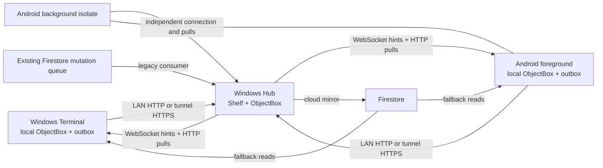

# Windows Hub, Windows Terminal, Android Terminal: sync reliability audit

Date: 3 October 2026. Architecture index: [BRAIN.md](../../BRAIN.md).

## Verdict

The system is usable as an offline-first prototype, but it is **not failure-proof or ready for an unconditional production reliability claim**. The local ObjectBox database and durable client outbox are good foundations. There were concrete loss, corruption, acknowledgement and recovery gaps in the implementation inspected at the start of this audit. Several are fixed below. The remaining protocol and device tests are release gates, not optional polish.

This review reads actual handlers, providers, startup wiring and database code. An earlier implementation-status document describes some safeguards absent from those source files. The conclusions here do not assume those claims are implemented. Existing local changes were preserved. A separate merge began during validation and introduced conflicts; validation status is recorded separately below.

## Map and authority

The Hub should own accepted transactions and stock. Both terminals are optimistic local replicas. Windows Terminal is selected by `settings.isWindowsClient` and a separate terminal database directory. It shares `SyncService` and `SyncQueueService` with Android. Android additionally opens its database and runs connections/pulls in a background isolate.

| Component | Source and responsibility |
| --- | --- |
| Startup and foreground event handlers | `lib/main.dart`: chooses role, starts services, responds to socket events and resume |
| Hub routes | `lib/shared/services/local_server_service.dart`, `hub/medicines_routes.dart`, `hub/sales_routes.dart` |
| Pulls, authentication, transport fallback | `lib/shared/services/sync_service.dart` |
| Outbox persistence and delivery | `sync_queue_service.dart`, `models/sync_queue_item.dart`, `sync/outbox_drain.dart` |
| Provider mutations | `providers/cart_provider.dart`, `inventory_provider.dart`, `patient_provider.dart`, `sales_provider.dart`, `mutation_service.dart` |
| Android background worker | `background_sync_service.dart` |
| Cloud mirror/legacy mutation consumer | `firebase_sync_service.dart`, `LocalServerService.handleExternalDelta` |
| Atomic Hub sale writes | `hub/sale_commit.dart` |

## Findings and changes made

### 1. Outbox could loop forever or silently lose mutations — critical

**Before:** `processQueue()` repeatedly queried all unprocessed rows in `while (true)`. A quarantined-only queue, or a failing photo remaining unprocessed, never made progress. Retry timestamps existed on the model but were not checked. Audit failures and unknown entities returned success. Five ordinary network failures quarantined a financial mutation, and dependent mutations could then proceed past it.

**Changed:** one finite, ordered snapshot per pass; persisted backoff is honoured; unacknowledged mutations remain pending; transport failures retry without automatic quarantine; malformed/unsupported payloads remain visible as quarantined blockers; failed photos get a delay and may allow later items to run; other blocked mutations preserve order. Outbox query handles are closed. Ordering breaks timestamp ties with local row ID.

**Still required:** an operator screen showing pending/blocked rows, reasons, retry deadlines, repair/retry controls and safe export. Existing quarantined rows are retained and deliberately not silently reactivated. HTTP authorization/conflict failures currently share the retry path and need structured error classification. One blocked non-photo item conservatively stops later work.

### 2. Hub sale and stock were separate commits — critical

**Before:** Hub HTTP and cloud paths saved a sale, reverted stock or deducted stock through separate database writes. Failure on a later line could leave a recorded sale with incomplete deductions, or an edited sale with reverted stock. Deletion restored quantities using a separate, inconsistent batch selection path.

**Changed:** `SaleCommit` performs sale lookup, old-stock reversal, new-stock deductions and sale persistence inside one ObjectBox write transaction. HTTP and legacy cloud sale paths use the same service. Deletion uses the same stock rules and transaction boundary. Exact replay is acknowledged without stock changes. Empty invoice keys are rejected.

**Still required:** operation receipts, immutable operation IDs, revision checks for edits and persisted actual batch allocations. Invoice-based deduplication alone does not stop an older delayed edit from overwriting a newer edit. Where a sale omitted a batch, aggregate/FIFO deduction and later reversal cannot prove the exact original allocation. The Hub must independently validate quantities, pricing, payment totals and return entitlement.

### 3. Client sale/outbox crash window and invoice collisions — critical

**Before:** the client saved its sale and only queued it much later. A crash in between could leave a sale that was never delivered. Millisecond timestamps alone generated invoice identity, so two terminals could produce the same invoice.

**Changed:** checkout stores the sale and its outbox row in one write transaction; delivery starts after persistence. New invoice numbers append a UUID. Existing invoice numbers are retained when editing.

**Still required:** the whole local checkout, including stock, facts, appointment/prescription state and all outbox rows, needs a single unit of work. The current fix closes the sale/outbox gap; it does not make all provider work one transaction. Several inventory provider methods still send medicine snapshots directly instead of uniformly persisting an outbox row.

### 4. Pull checkpoints advanced after failures — critical

**Before:** pull methods swallowed failures; non-200 pages stopped pagination as if it had finished. Full-pull orphan cleanup could consequently delete local rows after an incomplete response. `syncAll()` advanced a global timestamp even if a collection failed, and used a timestamp obtained after some queries or the client's clock. A day-only pull could also move the global marker past older changes.

**Changed:** checked HTTP reads throw on non-200 responses and have a deadline. Pull/apply errors mark the cycle incomplete. The checkpoint uses the Hub health clock captured before collection reads, is saved only after a successful cycle, and does not advance for day-only pulls. Users and settings are included. Device-local role, address and transport preferences remain local when settings refresh.

**Still required:** a durable Hub change sequence with per-client cursors, bounded snapshots and keyset pagination. Current Hub endpoints use offset pagination; inserts/deletes during paging can shift rows. Wall-clock timestamps and a one-minute overlap cannot guarantee recovery from arbitrary clock changes or old offline mutations. H1 filtering by `saleDate` can miss old sales arriving today. Pulls are applied collection by collection, not as one consistent cross-collection snapshot.

### 5. Refresh could overwrite offline work — critical

**Changed:** pulls defer an entity group when it has pending local outbox mutations. Medicine pulls also defer while sale/transfer/purchase rows are pending because those mutate stock. Full refresh drains the queue first and refuses reconciliation if pending rows remain. It no longer wipes the database before fetching. Cloud snapshots defer while local mutations are pending.

**Still required:** recheck ownership at apply time, serialize pull/write work, and protect the foreground/background boundary. The current check occurs at pull entry; a new mutation arriving while a network request is in flight still creates a race. Foreground and background WebSocket deletion handlers can also delete a row independently of this guard. A full refresh reconciles collections individually; it is not a whole-database atomic replacement.

### 6. Shop identity and pairing — critical

**Before:** health returns `{data: {shopId, timestamp}}`, but pairing looked for a top-level shop ID. Its intended identity check was bypassed. Automatic shop switching would erase local entity boxes while leaving unsent outbox rows and users, allowing cross-shop delivery.

**Changed:** health decoding supports the actual envelope and legacy flat replies and requires an identity and clock. Pairing with a different stored shop identity is refused without deleting data. Normal sync checks Hub identity again. A failed identity check does not replace the current address.

**Still required:** each queued operation must store immutable shop ID, device ID and operation ID; pairing must authenticate the Hub identity rather than trust a shared-secret health response. An explicit safe reset/export workflow is required to move an existing terminal to another shop. A first-pairing migration for any deployment that already assigns a terminal-local shop ID must be tested.

### 7. Firebase staging was treated as completed delivery — critical

**Before:** local HTTP timeout could be followed by tunnel retry and then Firebase staging. The queue row was marked processed when Firestore accepted it, without proof that the Hub applied it. The cloud consumer covered only some entities/actions and still removed unsupported changes. A medicine deletion matched the medicine upsert branch. Several cloud reads ignored REST page tokens and used unauthenticated requests.

**Changed:** new mutation delivery requires an acknowledgement from the Hub over LAN or the tunnel. Firebase remains a read/mirror channel and a consumer of existing legacy deltas; it no longer causes new local mutations to be marked complete merely by staging. Unsupported legacy mutations are retained. Medicine deletes reach the delete branch. Legacy cloud sales use atomic commits. REST reads fetch every page, authenticate, fail visibly on HTTP errors and reject repeated tokens. Windows queue polls do not overlap and await each callback, ordered by timestamp and name. The startup callback returns that future. Cloud fetch exceptions reach the sync result. Cloud reads currently use complete snapshots, avoiding a client-clock incremental cursor.

**Tradeoff:** Firebase-only/offline mutations remain pending until the Hub becomes directly reachable. Cloud full reads cost more than incremental reads. This is an explicit reliability compromise; restoring writable cloud fallback requires durable staging IDs, Hub acceptance/rejection receipts and equal validation on every transport.

**Still required:** cross-process leases, revision ordering and cloud commit receipts. Deployed Firestore rules were not inspected. Legacy handlers still differ from HTTP in patient, appointment, prescription, inventory and authorization semantics. The mirror has best-effort writes and completion markers and needs its own durable outbox; mirror failure must not advance a successful mirror cursor.

### 8. Missed events and Android lifecycle — high

**Changed:** the connected client periodically performs catch-up pulls, socket reconnection drains the queue then catches up, the connection watcher does not overlap itself, and socket handshakes have a deadline. Socket disposal closes the channel. WebSocket events are hints; periodic pull recovery is necessary even if the socket remains connected.

**Still required:** one writer/dispatcher owner per database. Isolate-local `_isProcessing` and `_isSyncing` do not prevent Android foreground and background workers from racing. Background initialization retries a locked store rather than reliably sharing ownership. Timers/subscriptions need complete stop/dispose cancellation, reconnect generations and single-flight handshakes. Test OS sleep, process death, Doze and foreground-service limits on physical devices. Background execution cannot be assumed to remain alive indefinitely.

### 9. Inventory authority and security — release blockers

Whole medicine snapshots can overwrite stock accepted from another terminal. Transfers persist a UUID before separately changing stock; a crash can leave the transfer recorded without stock movement and replay can then acknowledge it. Clamping insufficient transfer stock to zero can hide an impossible move. Purchases and medicine updates are separate operations and need a unified atomic command. Local ObjectBox IDs and mutable names are still used to identify some shared entities.

Use Hub-authoritative commands (`sell`, `return`, `receive`, `transfer`, `adjust`) with immutable product/batch identities. Never sync absolute stock from a stale replica as an authoritative update. Offline stock is provisional; two disconnected terminals cannot both guarantee selling the last available unit without a reservation/quota model. Show that distinction to staff and surface Hub rejection as a resolvable conflict.

The inspected Hub uses a shared pairing secret as a JWT signing secret, has plaintext LAN HTTP/WS and secret query parameters for sockets, and lacks uniform current-user/field-level authorization in its live route middleware. Existing permission/signing helper files do not establish that every live handler uses them. Fix those live paths, test revocation, and verify deployed shop membership rules before release. Synchronizing credentials and trusting incoming patient/local foreign IDs also require explicit policy.

## Required final protocol

1. Persist an immutable operation envelope with `{protocolVersion, shopId, deviceId, operationId, entityId, expectedRevision, payload}` in the same local transaction as optimistic entity changes.
2. Deliver at least once. Hub transaction checks the operation receipt, validates permissions/revision/business rules, applies all stock/history changes, saves the receipt and appends a change-sequence record atomically. Duplicate operation IDs return the saved result. Conflicts return a durable rejection; they do not silently overwrite.
3. Distinguish local pending, cloud staged, Hub accepted and rejected. Only Hub acceptance clears the mutation. A staging transport never changes authority.
4. Pull by durable monotonically increasing change sequence with tombstones for every deletion. Capture a snapshot upper bound and paginate by sequence/ID, never offsets or device clocks. Save the cursor with applied changes. Include an epoch/version to detect Hub restore and force safe reconciliation.
5. Assign one foreground/background sync owner through a persisted expiring lease or a dedicated worker. Other isolates send commands to that owner. Serial execution and idempotent receipts protect crash recovery.
6. Add a sync health screen and metrics: oldest pending age, pending/rejected/quarantined count, last acknowledged sequence, last complete pull, transport, retry reason, device/shop identity and reconciliation status. A successful `/health` or socket connection is not proof of complete synchronization.

## Validation and release gates

All **26 isolated sync regression tests pass** in the current workspace. They cover finite queue draining, delayed retry, a 30-attempt outage without abandonment, photo failure, audit retention, invalid payloads, health identity envelopes, HTTP/auth failure, hung pull deadlines, authenticated REST pagination and actual disposable ObjectBox sale rollback/replay/deletion. The wider domain/service/utility run had 59 passing tests and three test-file compilation failures caused by the separate merge's conflicts. The first targeted analyzer run before that merge reported no errors; the integrated analyzer now fails on conflict markers and their cascading syntax errors. Final integrated verification remains pending until conflicts are resolved. Evidence from the isolated rerun is in `.dart_tool/sync-audit-targeted-tests.log` (generated local file).

Do not interpret these unit/transaction checks as physical Windows/Android end-to-end validation. Required scenarios:

| Fault injection | Required invariant |
| --- | --- |
| Kill client at every checkout boundary and restart | sale, stock/facts and outbox agree; no unqueued committed sale |
| Hub commits, response is dropped; retry via LAN/tunnel/cloud | exactly one operation effect and one receipt |
| Failure on line 2 of a sale or edit | all stock and sale changes roll back |
| Hub power loss during transfer/purchase | no history-only or stock-only commit |
| Two terminals sell the last units offline | explicit provisional/rejected outcome; no hidden clamping |
| Insert/delete/update while reading more than 500 records | no skipped rows, no incomplete-snapshot orphan deletions |
| Delete while another terminal is offline | durable tombstone reaches it after reconnect/restart |
| Device or Hub clock shifts by a day | operation order/cursor unaffected |
| Suspend Android, kill foreground, restart background service | one dispatcher, no overlapping sends/unsafe deletes |
| Wrong shop, Hub restore, expired credentials, revoked user | no cross-shop upload or unauthorized mutation |
| Unsupported/malformed cloud mutation | retained rejection/repair state, never false acknowledgement |
| Full refresh with pending transactions or interrupted pages | pending work retained and recoverable |

## Primary references

- [ObjectBox transactions](https://docs.objectbox.io/transactions): explicit transactions group multiple database operations into an atomic commit; use a synchronous callback for `runInTransaction`.
- [Firestore cursor pagination](https://firebase.google.com/docs/firestore/query-data/query-cursors): cursor-based pagination supports bounded pages without offset traversal.
- [Dart Future implementation and timeout contract](https://github.com/dart-lang/sdk/blob/main/sdk/lib/async/future.dart): a timeout does not prove the underlying operation stopped. A lost acknowledgement therefore requires idempotent server handling.

The risk ranking, proposed protocol and code conclusions above are this audit's analysis of this repository; they are not claims that the referenced products automatically provide the application's missing guarantees.
