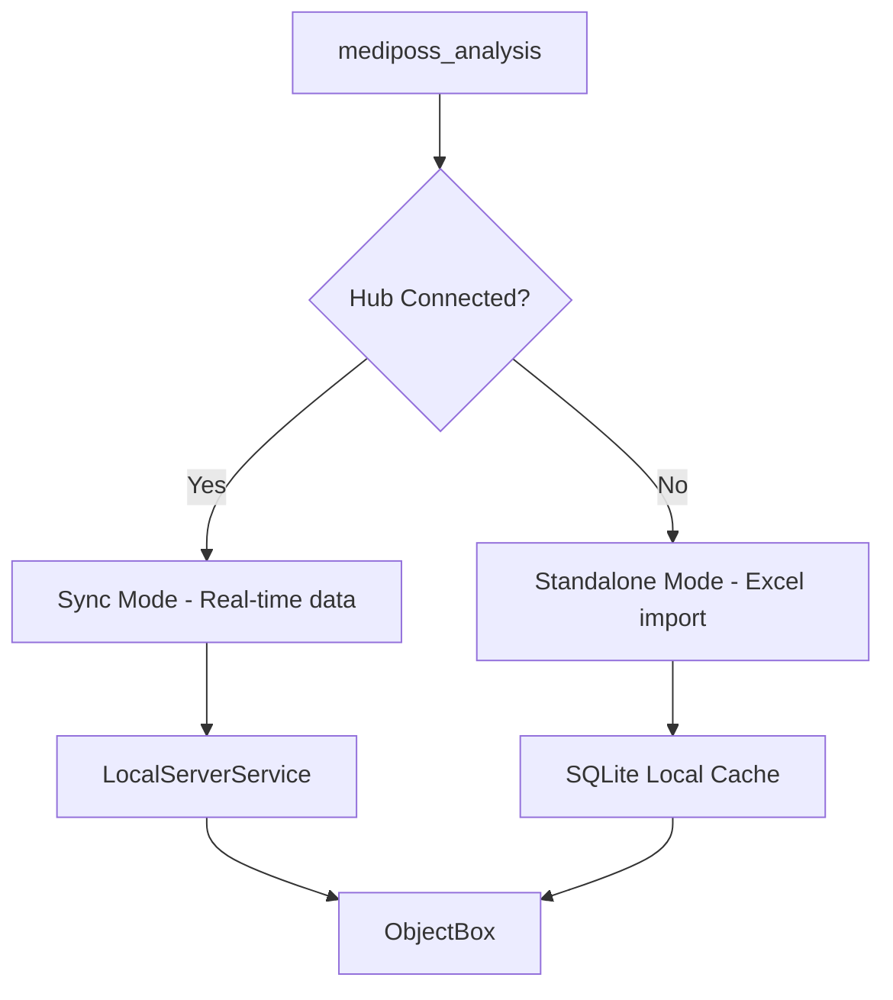
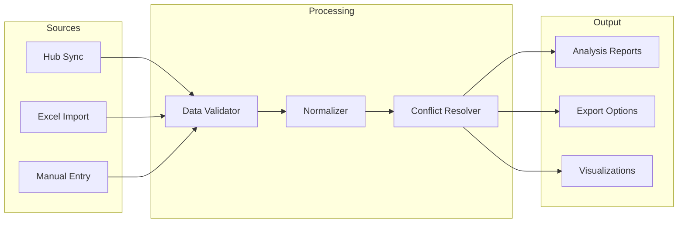

# MediPoss Upgrade Roadmap

## Executive Summary

This document provides a prioritized roadmap for upgrading the MediPoss medical POS ecosystem. The analysis identifies significant technical debt, security vulnerabilities, and architectural inefficiencies that should be addressed systematically.

---

## Key Findings

| Issue | Severity | Impact |
|-------|----------|--------|
| Plain-text PIN storage | **CRITICAL** | Complete auth bypass |
| Hardcoded JWT secret | **CRITICAL** | Token forgery possible |
| ~80% code duplication (Android/Windows) | **HIGH** | Maintenance nightmare |
| JSON storage for complex objects | **MEDIUM** | Query limitations |
| No encryption at rest | **HIGH** | Data exposure risk |
| No ObjectBox migration strategy | **MEDIUM** | Data loss on schema changes |

---

## High-Priority Upgrades (Immediate Impact)

### 1. Security Hardening (CRITICAL)

#### 1.1 PIN Security - Hash Authentication

**Current State:**
```dart
// lib/shared/models/app_user.dart:10
String pin; // Plain-text storage
```

**Recommendation:**
- Implement bcrypt or Argon2 hashing for PIN storage
- Add salt per-user to prevent rainbow table attacks
- Implement secure comparison (constant-time)

**Implementation:**
```dart
// New AppUser model
String pinHash;      // Bcrypt/Argon2 hash
String pinSalt;      // Per-user salt
int pinFailedAttempts; // Brute-force protection
DateTime? pinLockoutUntil;
```

**Migration Path:**
1. Add new fields alongside existing `pin`
2. On first login, migrate plain-text to hashed
3. Use gradual rollout with feature flag

#### 1.2 JWT Secret - Externalize & Secure

**Current State:**
```dart
// lib/shared/models/app_user.dart:100
this.jwtSecret = 'medipos_secret_key_2024', // HARDCODED!
```

**Recommendation:**
- Externalize to environment variable or secure vault
- Generate strong random secret on first launch
- Implement JWT expiration (currently appears perpetual)

**Implementation:**
```dart
String get _jwtSecret {
  final configured = ObjectBoxService.instance.settings.jwtSecret;
  if (configured.isEmpty || configured == 'medipos_secret_key_2024') {
    return _generateSecureSecret();
  }
  return configured;
}
```

#### 1.3 Data Encryption at Rest

**Recommendation:**
- Implement AES-256 encryption for sensitive fields
- Use platform keychain (Windows DPAPI, Android Keystore)
- Encrypt: PIN hash, patient PHI, prescription data

**Dependencies:**
```yaml
dependencies:
  flutter_secure_storage: ^9.0.0
  encrypt: ^5.0.3
```

---

### 2. Code Deduplication - Adaptive UI Architecture

**Current Problem:**
- 34+ Platform.is checks scattered across files
- ~80% identical code in Android/Windows folders
- Bug fixes require dual implementation

**Recommendation:** Implement Adaptive Widget Pattern

```dart
// lib/widgets/adaptive/
abstract class AdaptiveWidget extends StatelessWidget {
  const AdaptiveWidget({super.key});
  
  static T of<T extends AdaptiveWidget>(BuildContext context) {
    return context.findAncestorWidgetOfExactType<T>()!;
  }
}

class AdaptiveLayout extends StatelessWidget {
  final Widget? mobile;
  final Widget? desktop;
  final Widget? tablet;
  
  const AdaptiveLayout({
    super.key,
    this.mobile,
    this.desktop,
    this.tablet,
  });
  
  @override
  Widget build(BuildContext context) {
    final screenWidth = MediaQuery.of(context).size.width;
    if (screenWidth < 600) return mobile ?? desktop ?? const SizedBox();
    if (screenWidth < 1200) return tablet ?? desktop ?? const SizedBox();
    return desktop ?? const SizedBox();
  }
}
```

**Migration Strategy:**
1. Extract common widgets to `lib/shared/widgets/`
2. Create adaptive wrappers only where layout differs
3. Remove Platform.is checks from business logic

---

## Medium-Term Improvements (Technical Debt Reduction)

### 3. Data Storage Modernization

#### 3.1 Replace JSON with Proper Relations

**Current State:**
```dart
// lib/shared/models/sale.dart:32
String itemsJson; // Stored as '[]' JSON string
```

**Recommendation:**
- Create `SaleItem` as proper ObjectBox entity
- Implement one-to-many relationship
- Enable direct queries on line items

**New Schema:**
```dart
@Entity()
class SaleItem {
  @Id()
  int id = 0;
  
  @Backlink('items')
  final sale = ToOne<Sale>();
  
  int medicineId;
  String medicineName;
  int quantity;
  double unitPrice;
  double discount;
  double subtotal;
}

@Entity()
class Sale {
  // ... existing fields
  
  final items = ToMany<SaleItem>();
}
```

#### 3.2 ObjectBox Migration Strategy

**Current Problem:** Schema changes require database regeneration

**Recommendation:**
- Implement versioned schema with migration callbacks
- Use ObjectBox's built-in migration system

```dart
// lib/shared/services/objectbox_service.dart
Store openStore() {
  return openStore(
    models: [MedicineModel, SaleModel, /* ... */],
    migrationCallback: (store, fromVersion) {
      if (fromVersion < 2) {
        // Migrate v1 -> v2
      }
    },
  );
}
```

**Best Practices:**
- Document schema versions
- Never delete fields, mark as @Deprecated
- Test migrations thoroughly

---

### 4. Architecture Improvements

#### 4.1 Unified App Architecture

**Current Split:**
- mediposs_analysis: Standalone + Hub client
- Ambiguous use case (Excel import vs real-time sync)

**Recommendation:**


#### 4.2 Responsive Design System

**Recommendation:**
- Create design tokens in `lib/theme/`
- Implement breakpoints consistently
- Remove platform detection for layout decisions

```dart
// lib/theme/breakpoints.dart
class AppBreakpoints {
  static const double mobile = 600;
  static const double tablet = 1200;
  static const double desktop = 1600;
  
  static bool isMobile(BuildContext c) => 
    MediaQuery.of(c).size.width < mobile;
}
```

---

## Long-Term Architectural Improvements

### 5. Cloud-Ready Architecture

#### 5.1 API Layer Abstraction

**Recommendation:**
- Create abstract repository interfaces
- Implement local/remote switching
- Prepare for future cloud backend

```dart
abstract class MedicineRepository {
  Future<List<Medicine>> getAll();
  Future<Medicine?> getById(int id);
  Future<void> save(Medicine medicine);
  Future<void> delete(int id);
}

class LocalMedicineRepository implements MedicineRepository {
  // ObjectBox implementation
}

class RemoteMedicineRepository implements MedicineRepository {
  // HTTP/API implementation
}

class CachedMedicineRepository implements MedicineRepository {
  final LocalMedicineRepository local;
  final RemoteMedicineRepository remote;
  // Cache-first with background sync
}
```

#### 5.2 Event-Driven Architecture

**Recommendation:**
- Implement event bus for loose coupling
- Replace direct provider dependencies
- Enable microservices decomposition

```dart
class AppEventBus {
  static final AppEventBus _instance = AppEventBus._();
  factory AppEventBus() => _instance;
  
  final _controller = StreamController<AppEvent>.broadcast();
  
  void publish(AppEvent event) => _controller.add(event);
  Stream<T> events<T extends AppEvent>() => 
    _controller.stream.whereType<T>();
}

// Events
class SaleCompletedEvent extends AppEvent {
  final Sale sale;
}

class InventoryUpdatedEvent extends AppEvent {
  final Medicine medicine;
  final int quantityChange;
}
```

---

### 6. mediposs_analysis Enhancement

#### 6.1 Unified Data Pipeline

**Recommendation:**


#### 6.2 Advanced Analytics Features

| Feature | Description | Priority |
|---------|-------------|----------|
| Stock Movement Analysis | Track inventory trends over time | High |
| Sales Forecasting | Predict peak periods | Medium |
| Profit Margin Analysis | Per-medicine profitability | High |
| Customer Segmentation | Frequent vs occasional buyers | Medium |
| Expiry Alerts | Medicines approaching expiry | High |

---

## New Features to Consider

### 7. Feature Recommendations

#### 7.1 Inventory Intelligence

```dart
class InventoryIntelligence {
  // Low stock prediction
  Future<List<Medicine>> predictLowStock({int daysAhead: 7});
  
  // Reorder suggestions
  Future<Map<int, int>> suggestReorderQuantities();
  
  // Expiry warnings
  Future<List<Medicine>> getExpiringMedicines({int daysThreshold: 90});
}
```

#### 7.2 Customer Loyalty Program

- Track repeat patients by phone number
- Offer discount tiers
- SMS notifications for refills

#### 7.3 Multi-Location Support

- Warehouse-to-warehouse transfers
- Centralized dashboard for all branches
- Location-based inventory views

#### 7.4 Prescription Analytics

- Drug interaction warnings
- Prescription pattern analysis
- Regulatory compliance checks

---

## Implementation Priority Matrix

| Priority | Item | Effort | Impact | Quarter |
|----------|------|--------|--------|---------|
| P0 | PIN Hashing | Medium | Critical | Q1 |
| P0 | JWT Hardening | Low | Critical | Q1 |
| P0 | Encryption at Rest | High | High | Q1 |
| P1 | Code Deduplication | High | High | Q2 |
| P1 | JSON→Relation Migration | Medium | Medium | Q2 |
| P1 | ObjectBox Migration | Medium | Medium | Q2 |
| P2 | API Abstraction | High | High | Q3 |
| P2 | Event Architecture | Medium | Medium | Q3 |
| P3 | Analytics Enhancement | High | Medium | Q4 |
| P3 | Multi-location | Very High | Medium | Q4+ |

---

## Risk Mitigation

### Known Risks

| Risk | Mitigation |
|------|------------|
| Migration data loss | Full backup before schema changes; rollback plan |
| Breaking existing sync | Maintain backward compatibility for 2 versions |
| Performance regression | Benchmark before/after each change |
| User confusion | Gradual rollout with feature flags |

### Testing Strategy

1. **Unit Tests**: All business logic
2. **Integration Tests**: Database operations
3. **E2E Tests**: Critical user flows
4. **Performance Tests**: Query benchmarks
5. **Security Tests**: Auth bypass attempts

---

## Summary

The MediPoss ecosystem requires immediate security fixes followed by systematic technical debt reduction. The recommended approach prioritizes:

1. **Immediate**: Secure PIN storage, JWT hardening, encryption
2. **Near-term**: Code deduplication, data model improvements
3. **Long-term**: Cloud-ready architecture, advanced analytics

Following this roadmap will result in a more maintainable, secure, and scalable system while minimizing disruption to existing workflows.
